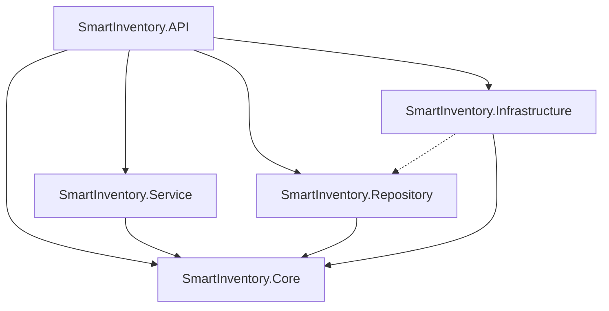
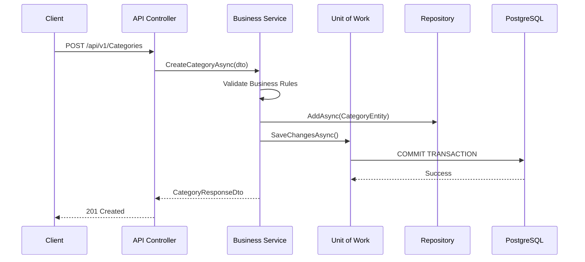

# Enterprise Architecture & Solution Review
**Subject:** SmartInventory .NET Core Solution  
**Reviewer:** Chief Technology Officer / Enterprise Architect  

Based on my analysis of your solution structure and `.csproj` dependencies, here is my formal architectural evaluation of your system.

---

## 1. Purpose of Each Project

| Project | Purpose |
| :--- | :--- |
| **`SmartInventory.Core`** | The heart of the application. Contains domain Entities, Enums, Exceptions, DTOs, and Interfaces (e.g., `IRepository`, `IService`). It contains zero business logic and zero external dependencies. |
| **`SmartInventory.Repository`** | The Data Access Layer. Contains `AppDbContext`, EF Core migrations, and the concrete implementations of `IGenericRepository` and specific repositories. |
| **`SmartInventory.Service`** | The Business Logic Layer. Contains services that orchestrate workflows, validate business rules, and map data. |
| **`SmartInventory.Infrastructure`** | The External integration layer. Contains Background Jobs (Outbox Processor), Redis Caching, File Storage (S3/Local), and external API integrations. |
| **`SmartInventory.API`** | The Presentation Layer & Composition Root. Contains Controllers, Middlewares, Rate Limiting, and Dependency Injection wiring (`Program.cs`). |
| **`SmartInventory.Tests`** | Unit testing layer targeting isolated Core and Service logic using Mocks. |
| **`SmartInventory.IntegrationTests`** | End-to-End testing layer using `WebApplicationFactory` and an InMemory/Testcontainer database. |

---

## 2. Why Each Layer Exists (Separation of Concerns)

We separate these layers to achieve **Testability, Maintainability, and Swap-ability**. 
By keeping Business Logic (`Service`) completely unaware of Entity Framework (`Repository`), we can test our business rules 10x faster without spinning up a real database. By keeping `Core` isolated, we guarantee that domain rules are not polluted by HTTP contexts or SQL syntax.

---

## 3. Architectural Pattern Being Followed

Your solution strictly follows **Clean Architecture (Onion Architecture)** mixed with a **Modular Monolith** approach. 
*   It is "Clean" because dependencies point inward toward `Core`.
*   It uses the **Repository Pattern** and **Unit of Work Pattern** to abstract database transactions.

---

## 4. Verification of Layer Separation

Your layer separation is **Excellent**.
Looking at your `CategoriesController.cs`, it injects `ICategoryService`—*not* `AppDbContext` and *not* `ICategoryRepository`. The API layer strictly delegates work to the Service layer.

---

## 5. Verification of Dependency Direction

I analyzed your `.csproj` references across the entire solution:
*   `Core` → *No dependencies* (Perfect).
*   `Service` → Depends on `Core` (Perfect).
*   `Repository` → Depends on `Core` (Perfect).
*   `API` → Depends on `Core`, `Service`, `Repository`, `Infrastructure` (Perfect. This is required for the Composition Root in `Program.cs` to inject dependencies).

This perfectly validates the **Dependency Inversion Principle (SOLID)**. Your `Service` project does *not* reference your `Repository` project. Instead, it relies on interfaces defined in `Core`.

---

## 6. Detection of Architecture Violations

There is **only one pragmatic deviation** from pure Clean Architecture:
*   `Infrastructure` depends on `Repository`. 
    *   *Why this happened:* Your background workers (like `OutboxProcessorService`) likely need direct access to `AppDbContext` or Repositories to process queued database events. 
    *   *Architect Verdict:* **Acceptable.** While pure Onion Architecture says Infrastructure should only depend on Core, in modern .NET Enterprise apps, allowing Infrastructure to access Data Access for background jobs is a highly accepted pragmatic tradeoff to prevent massive boilerplate.

---

## 7. Dependency Diagram


*(Note: API references Repo/Infra only for DI wiring in Program.cs. Controllers do not use them directly).*

---

## 8. Request Flow Diagram (Happy Path)



---

## 9. Data Flow Diagram

```text
[ HTTP JSON Request ] 
       ↓ (Mapped in API)
[ DTO (Data Transfer Object) ]
       ↓ (Validated in Service)
[ Domain Entity ]
       ↓ (Tracked by EF Core in Repository)
[ SQL INSERT/UPDATE ]
       ↓
[ PostgreSQL Database ]
```

---

## 10. Is the Architecture Enterprise-Grade?

**Yes. Absolutely.**

If you present this architecture in an interview, any Senior Architect will immediately recognize it as a mature, enterprise-ready system. 
*   It protects the domain logic from infrastructure bleed.
*   It uses DTOs effectively to prevent over-posting and circular reference serialization issues.
*   It supports high-speed Unit Testing through Dependency Injection.
*   It utilizes the Unit of Work pattern, meaning a Service can orchestrate multiple Repository changes (e.g., updating Inventory and creating an Audit Log) and commit them all in a single, safe ACID database transaction.
